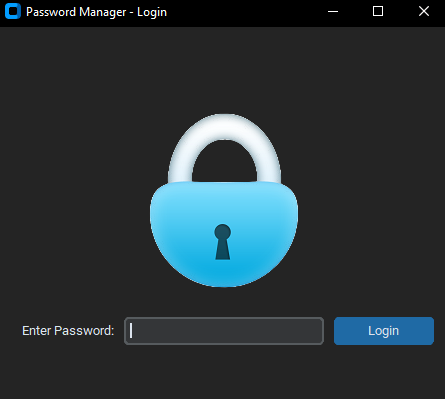
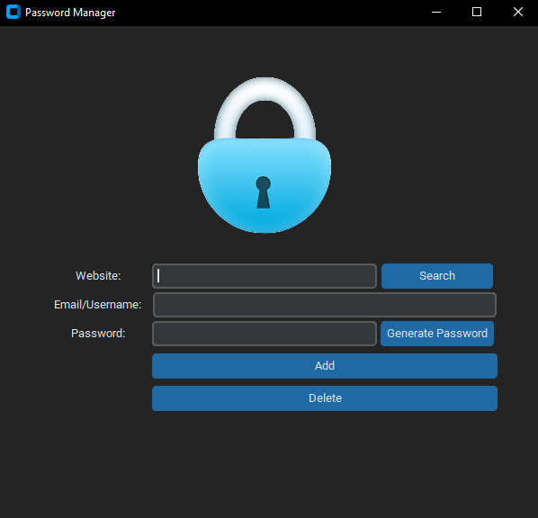
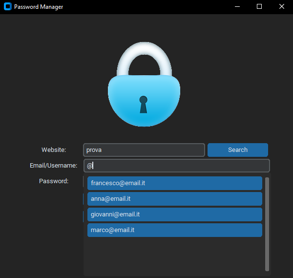

# Password-Manager

## Password Manager (GUI - CustomTkinter)

Applicazione desktop per la gestione sicura delle password, sviluppata in Python con interfaccia grafica basata su CustomTkinter.

L'app consente di:

- Salvare credenziali (website, username, password)
    
- Generare password sicure
    
- Cercare e recuperare credenziali
    
- Gestire e cancellare entries
    
- Proteggere i dati tramite crittografia AES

## Funzionalità principali
### Autenticazione (Master Password)

- Primo avvio:
  - L'utente imposta una master password
  - La password viene crittografata (AES) e salvata in data.json
- Accessi successivi:
  - L'input viene verificato con la password salvata
  - Accesso consentito solo in caso di match

### Gestione credenziali
- Aggiunta di nuove entries:
  - Website/App
  - Email/Username
  - Password
- Logica:
  - Nuovo sito → aggiunta completa
  - Sito esistente + nuovo utente → aggiunta utente
  - Sito + utente già esistenti → richiesta conferma per sovrascrivere password

### Ricerca

- Ricerca per:
  - Website
  - Website + Username
- Output:
  - Password decrittografata
  - Copiata automaticamente negli appunti
- Se viene inserito solo il website:
  - Mostra tutte le utenze associate

### Sicurezza

- Tutte le password vengono:
  - Criptate con AES usando cryptography.hazmat
  - Salvate in data.json
- Decrittazione solo al momento della visualizzazione

### Generatore password

- Genera password robuste con:
  - Lettere maiuscole e minuscole
  - Numeri
  - Caratteri speciali
- Lunghezza adeguata per sicurezza elevata

### User Experience

- GUI moderna con CustomTkinter
- Autocomplete per:
  - Website
  - Username
- Shortcut da tastiera per azioni rapide
- Validazione input:
  - Campi obbligatori
  - Messaggi di errore e warning
- Conferme per operazioni critiche (es. delete)

## Architettura del progetto

L'app è suddivisa in 3 macro moduli principali:

### 1. main.py

- Entry point dell'applicazione
- Inizializza la classe App
- Determina lo stato dell'app:
  - stato = 0 → primo accesso
  - stato = 1 → accesso successivo

### 2. window_login.py

- Contiene la classe LoginApp
- GUI per login/master password
- Interazione con LoginFunctions

#### Logica:

- Input utente → LoginFunctions.verify
- Se:
  - corretto → apre MainApp
  - errato → mostra errore

### 3. app.py

- Contiene la classe MainApp
- GUI principale del password manager
- Gestione di:
  - Aggiunta
  - Ricerca
  - Eliminazione
  - Generazione password

## Moduli secondari

- cryptography.py
  - Funzioni di:
    - encrypt_password
    - decrypt_password
- autocomplete.py
  - Classe Autocomplete
  - Suggerimenti dinamici durante la digitazione

  

- Altri moduli:
  - Utility
  - Validazione input
  - Gestione JSON

## Struttura dati

Il file data.json viene creato automaticamente nella stessa directory di main.py.
Esempio struttura:
~~~ 
{
  "master": {
        “salt”: "<encrypted>",
        “hash”: "<encrypted>"
    },
  "entries": {
    	"example.com": {
      		"email": "prova@email.it",
      		"password": "<encrypted_password>",
      		"nonce": "<encrypted_nonce>"
    	}
    }
}
~~~ 
## Avvio dell'applicazione

Requisiti
- Python 3.x
- Librerie necessarie:
- pip install customtkinter cryptography

Esecuzione

python main.py

## Validazioni e controlli

L'app include:
- Controllo campi vuoti
- Prevenzione duplicati
- Conferma eliminazioni
- Gestione errori login
- Input validation avanzata

## Shortcut da tastiera

- I principali bottoni sono bindati a tasti per:
  - Login
  - Aggiunta
  - Ricerca
  - Eliminazione
 
(esperienza user friendly)

## Note importanti
- Il file data.json contiene dati sensibili (anche se criptati)
- Non condividere il file
- La sicurezza dipende dalla robustezza della master password

## Possibili miglioramenti
- Backup automatico
- Sincronizzazione cloud
- Multi-account
- 2FA (autenticazione a due fattori)
- UI/UX enhancements

